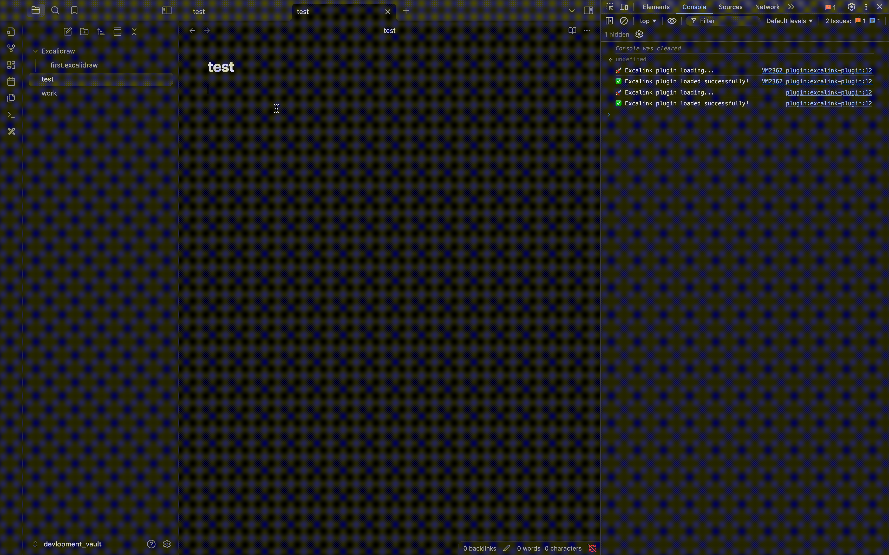

# Excalink Plugin

An Obsidian plugin that enables smart auto-suggestion of frame names from `.excalidraw.md` files when typing `[[filename#` in the editor.

## Demo



*Watch Excalink in action: Type `[[filename#` and get instant frame suggestions with fuzzy search and auto-completion!*

## Features

- 🔍 **Smart Frame Detection**: Automatically scans all `.excalidraw.md` files in your vault
- 🎯 **Real-time Pattern Detection**: Detects `[[filename#` typing patterns in the editor
- 🎭 **Fuzzy Search Modal**: Shows interactive frame suggestions with fuzzy matching  
- 📅 **Smart Frame Ordering**: Displays frames in reverse chronological order (newest first)
- 🖼️ **Frame Preview**: Visual frame suggestions with icons and file context
- 🔗 **Auto-completion**: Automatically replaces partial links with complete frame references
- 🗜️ **Format Support**: Handles both compressed and regular Excalidraw formats
- 🔧 **Smart Filename Matching**: Supports multiple filename variations and formats
- ⚡ **Debounced Input**: Optimized performance with intelligent timing
- 🎯 **Cursor Management**: Preserves cursor position and handles edge cases gracefully
- 💾 **Performance Caching**: Intelligent caching system to avoid repeated file reads
- 📡 **File Watching**: Automatically updates frame index when files change
- 🛡️ **Robust Error Handling**: Graceful handling of malformed files and edge cases
- 🧪 **Comprehensive Testing**: Built-in test suite for validation and debugging
- ⚙️ **Comprehensive Settings**: Full user configuration with settings panel for all features

## How to use

### Quick Start

1. **Create frames** in your Excalidraw drawings and give them names
2. **Type the pattern** `[[filename#` in any note - the plugin detects this in real-time
3. **Select from suggestions** - A fuzzy search modal appears showing all matching frames from that file (newest frames first)
4. **Navigate and filter** - Use ↑↓ to navigate, ↵ to select, or Esc to dismiss. Type to filter with fuzzy search
5. **Auto-insertion** - Selecting a frame automatically inserts the complete link: `[[filename#^frame=frameName]]`
6. **Continue editing** - The cursor is positioned after the inserted link for continued editing

### Settings Configuration

Access plugin settings via **Settings → Community Plugins → Excalink Plugin → Settings**

#### Core Functionality

- **Enable Frame Suggestions**: Main toggle for the plugin functionality
- **Enable File Watching**: Automatic updates when Excalidraw files change
- **Auto Scan on Startup**: Scan all files when Obsidian starts

#### Performance Settings

- **Enable Caching**: Improves performance by caching frame data
- **Max Cache Size**: Control memory usage (default: 100 files)
- **Debounce Delay**: Typing delay before triggering suggestions (default: 300ms)

#### Modal Behavior

- **Enable Fuzzy Search**: Smart matching of frame names
- **Show Recent Frames First**: Newest frames appear at the top
- **Max Suggestions Displayed**: Limit number of suggestions shown (default: 50)
- **Modal Theme**: Choose between 'default' and 'minimal' appearance

#### Debug Options

- **Enable Debug Logging**: Detailed console output for troubleshooting
- **Show Diagnostics in Notices**: Display plugin status messages
- **Show Frame Icons**: Visual frame indicators in suggestions
- **Show File Context**: Display source file information in suggestions

## Visual Workflow

The plugin workflow is simple and intuitive:

1. **📝 Type the pattern**: Start typing `[[your-excalidraw-file#` in any note
2. **⚡ Instant detection**: Plugin detects the pattern in real-time
3. **🎭 Modal appears**: Fuzzy search modal shows all available frames
4. **🔍 Filter & select**: Type to filter, use arrows to navigate, Enter to select
5. **✅ Auto-completion**: Complete link inserted: `[[file#^frame=FrameName]]`


## Performance Features

### Smart Caching System (Day 5)

- **Intelligent Caching**: Files are only re-processed when they change
- **Content Hashing**: Detects actual content changes, not just modification times
- **Memory Efficient**: Optimized cache structure with minimal memory footprint
- **Automatic Updates**: Frame index updates automatically when files are modified

### File Watching (Day 5)

- **Real-time Updates**: Automatic frame index updates when Excalidraw files change
- **Event Handling**: Listens for file modifications, deletions, and renames
- **Background Processing**: All updates happen seamlessly without user intervention
- **Error Recovery**: Graceful handling of file system events and edge cases

### Robust Error Handling (Day 6)

- **Malformed File Support**: Gracefully handles broken or corrupted Excalidraw files
- **Fallback Mechanisms**: Multiple parsing strategies for maximum compatibility
- **Edge Case Handling**: Comprehensive validation and boundary checking
- **User Feedback**: Clear error messages and helpful guidance for troubleshooting

## Debug Commands

Access these commands through the Command Palette (Ctrl/Cmd + P):

- **Show Cache Statistics**: View current cache performance and memory usage
- **Show Plugin Diagnostics**: Comprehensive plugin health and status information
- **Force Rescan All Files**: Manually trigger a full rescan of all Excalidraw files
- **Run Comprehensive Tests**: Execute the built-in test suite for validation

## Installation

### From Obsidian Community Plugins (Recommended)

1. Open **Settings** in Obsidian
2. Navigate to **Community Plugins**
3. Click **Browse** and search for "Excalink"
4. Click **Install** and then **Enable**

### Manual Installation

1. Download the latest release from [GitHub Releases](https://github.com/AarambhaAnta/Excalink/releases)
2. Extract the files to your vault's plugins folder: `VaultFolder/.obsidian/plugins/excalink-plugin/`
3. Refresh plugins in Obsidian settings or restart Obsidian
4. Enable the plugin in **Settings → Community Plugins**

### Development Setup

```bash
# Clone the repository
git clone https://github.com/AarambhaAnta/Excalink.git
cd Excalink

# Install dependencies
npm install

# Start development build (watch mode)
npm run dev

# Build for production
npm run build
```

After building, enable the plugin in Obsidian settings.

## Troubleshooting

### Common Issues

1. **No frames showing up**:
   - Ensure your Excalidraw files contain named frames
   - Use "Force Rescan All Files" command to refresh the index
   - Check console for error messages

2. **Modal not appearing**:
   - Verify you're typing the correct pattern: `[[filename#`
   - Ensure the filename matches an existing Excalidraw file
   - Check "Show Plugin Diagnostics" for initialization status

3. **Performance issues**:
   - Use "Show Cache Statistics" to monitor cache usage
   - Clear cache using "Force Rescan All Files" if needed
   - Check console for performance warnings

### Getting Help

- Enable console logging to see detailed debug information
- Use the built-in diagnostic commands for troubleshooting
- Check the plugin status with "Show Plugin Diagnostics"

## Technical Architecture

### Core Components

1. **FrameIndexer**: Handles file scanning, frame extraction, and caching
2. **EditorExtension**: Manages pattern detection and editor integration
3. **FrameSuggestModal**: Provides fuzzy search interface for frame selection
4. **ExcalidrawDecompressor**: Handles compressed Excalidraw file formats

### File Processing Pipeline

1. **Discovery**: Scan vault for `.excalidraw.md` files
2. **Parsing**: Extract JSON data using multiple fallback strategies
3. **Frame Extraction**: Identify and catalog named frames
4. **Caching**: Store results with content hashing for efficiency
5. **Indexing**: Build searchable frame database

### Pattern Detection System

1. **Real-time Monitoring**: CodeMirror integration for live text analysis
2. **Debounced Processing**: Optimized performance with intelligent timing
3. **Pattern Matching**: Robust wikilink pattern detection
4. **Modal Triggering**: Smart modal activation based on context

## Roadmap

- [x] **Day 1**: Vault scanning & frame extraction
- [x] **Day 2**: Editor integration & pattern detection  
- [x] **Day 3**: Auto-suggestion modal with fuzzy search
- [x] **Day 4**: Frame text replacement with Obsidian block reference format (`#^frame=frameName`)
- [x] **Day 5**: Performance caching & automatic file watching
- [x] **Day 6**: Polish & test - Robust error handling, malformed file support, comprehensive testing
- [x] **Day 7**: Settings & release - Comprehensive user configuration and release preparation

### Future Enhancements

- [ ] **Batch Operations**: Bulk frame management tools
- [ ] **Advanced Filtering**: Date-based and tag-based frame filtering
- [ ] **Frame Templates**: Quick frame creation with predefined layouts
- [ ] **Integration Improvements**: Better mobile support and theme compatibility
- [ ] **Performance Optimizations**: Lazy loading and virtual scrolling for large collections
- [ ] **Export Features**: Frame data export and backup utilities

## Changelog

### Version 1.0.1 (2024-07-20)

#### Bug Fixes & Security Updates

- ✅ **Security Enhancement**: Replaced `innerHTML` with safe DOM API methods
- ✅ **Styling Improvements**: Moved inline styles to CSS for better theme compatibility
- ✅ **Performance Optimization**: Reduced console logging to prevent dev console pollution
- ✅ **Code Quality**: Enhanced adherence to Obsidian plugin development guidelines

### Version 1.0.0 (2024-07-19)

Initial Release - Complete 7-Day Development Sprint

#### Core Features

- ✅ **Smart Frame Detection**: Comprehensive `.excalidraw.md` file scanning and frame extraction
- ✅ **Real-time Editor Integration**: Instant pattern detection for `[[filename#` typing patterns
- ✅ **Interactive Modal Interface**: Fuzzy search modal with keyboard navigation and filtering
- ✅ **Intelligent Auto-completion**: Automatic link insertion with proper Obsidian block reference format
- ✅ **Performance Caching**: Advanced caching system with content hashing and automatic invalidation
- ✅ **File Watching**: Real-time frame index updates when Excalidraw files change

#### User Experience

- ✅ **Comprehensive Settings Panel**: Full user configuration with granular control options
- ✅ **Visual Frame Preview**: Frame suggestions with icons and file context information
- ✅ **Smart Ordering**: Chronological frame display with newest frames prioritized
- ✅ **Robust Error Handling**: Graceful handling of malformed files and edge cases
- ✅ **Debug Tools**: Built-in diagnostic commands and comprehensive logging

#### Plugin Architecture

- ✅ **Modular Design**: Clean separation of concerns with dedicated components
- ✅ **Type Safety**: Full TypeScript implementation with comprehensive type definitions
- ✅ **Memory Efficiency**: Optimized data structures and intelligent cache management
- ✅ **Extensibility**: Plugin architecture designed for future enhancements

#### Development Journey

- **Day 1**: Foundation - Vault scanning & frame extraction system
- **Day 2**: Integration - Editor integration & pattern detection engine
- **Day 3**: Interface - Auto-suggestion modal with fuzzy search capabilities
- **Day 4**: Completion - Frame text replacement with Obsidian block reference format
- **Day 5**: Performance - Advanced caching & automatic file watching system
- **Day 6**: Polish - Comprehensive error handling, testing, and malformed file support
- **Day 7**: Release - Settings configuration, documentation, and release preparation

## Support the Project

If Excalink saves you time and enhances your Excalidraw workflow, consider supporting its development:

- ⭐ **Star the repository** on GitHub
- 💖 **Sponsor on GitHub**: [github.com/sponsors/AarambhaAnta](https://github.com/sponsors/AarambhaAnta)
- ☕ **Buy me a coffee**: [ko-fi.com/aarambhaanta](https://ko-fi.com/aarambhaanta)
- 🐛 **Report issues** and suggest improvements
- 📢 **Share with others** who use Excalidraw + Obsidian

### Custom Plugin Development

Need a custom Obsidian plugin for your workflow? I offer:

- **Custom Plugin Development**: Tailored solutions for your specific needs
- **Plugin Consultation**: Expert advice on Obsidian automation and workflows
- **Training & Workshops**: Learn to build your own plugins

Contact: [your-email@example.com](mailto:your-email@example.com)

## License

MIT License - see [LICENSE](LICENSE) file for details.
